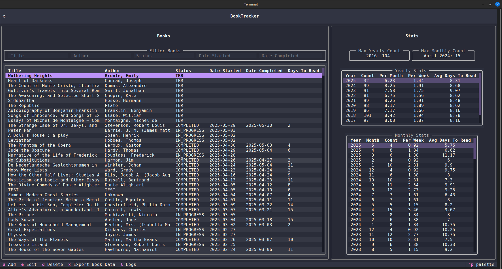
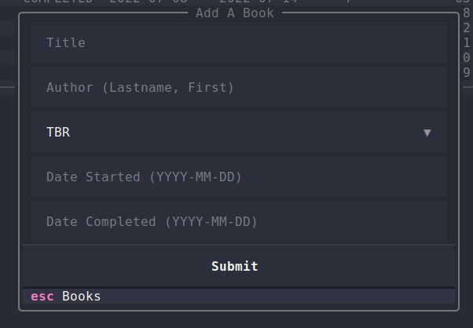
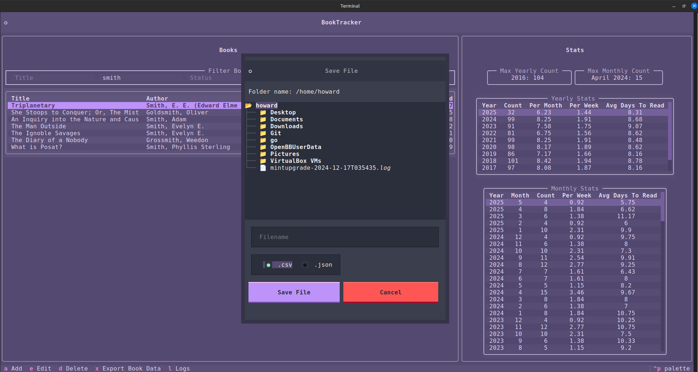

# BookTracker

[](https://opensource.org/licenses/MIT)

## About
A Python [Textual](https://www.textualize.io/) application to track books. The application allows users to
- View a DataTable of existing books
- Filter existing books by a DataTable field and a search term
- Add a new book
- Edit existing books
- Delete existing books
- View statistics (books per month or year, days to read)

## Installation
This project uses [UV](https://docs.astral.sh/uv/).

```bash
# SSH
git clone git@github.com:LuapRebel/booktracker.git
# HTTPS
git clone https://github.com/LuapRebel/booktracker.git

cd booktracker
uv sync
source .venv/bin/activate
```

## Usage
```bash
textual run src/app.py
```

## Default View
#### Books table and associated stats


## Filter View
To filter books, enter a search term into one of the input fields to search that field.


## Add a Book
To add a new book, press the `a` key from within the main **Books** table, enter the relevant information and press **Submit**.


## Edit a Book
To edit an existing book, press the `e` key after highlighting the Book you would like to edit. Once you have entered the relevant information, press **Submit**.


## Delete a Book
To edit an existing book, press the `d` key after highlighting the Book you would like to edit. A screen will appear asking you if you would like to delete the book. Click **Delete** to delete or **ESC** to cancel.


If you press **Delete**, a confirmation screen will appear to verify you would like to delete the book.


## Export Book Data
You can export all of the **Book** data by pressing `x`. A dialog box will appear which enables you to decide where to save the data as well as the option to export in either `.csv` or `.json` format.
